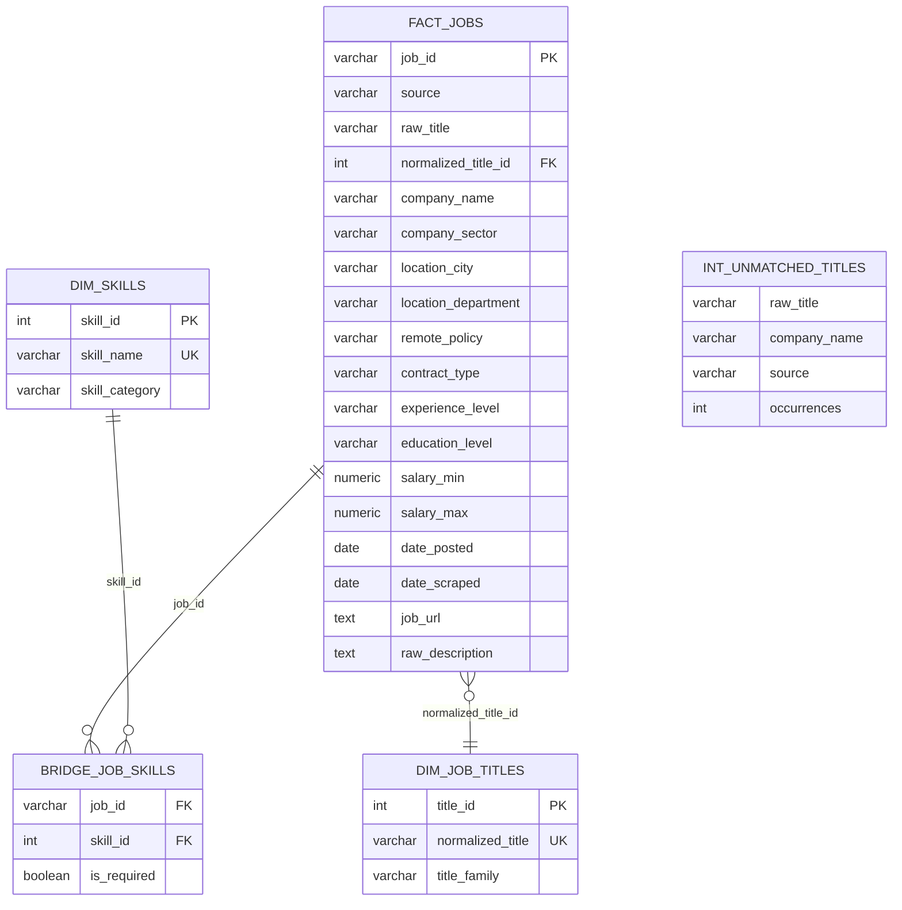

# Database Schema - Data Job Analysis (Star Schema)

## Entity Relationship Diagram



## Tables Overview

| Table | Schema | Description | Lignes estimees |
|-------|--------|-------------|-----------------|
| `fact_jobs` | analytics | Table de faits : 1 ligne = 1 offre unique dedupliquee | ~1 500-2 000/semaine |
| `dim_job_titles` | analytics | Dimension : 10 titres de postes normalises | 10 |
| `dim_skills` | analytics | Dimension : 77 competences techniques en 9 categories | 77 |
| `bridge_job_skills` | analytics | Bridge table N:N entre offres et competences detectees | ~10 000-15 000 |
| `int_unmatched_titles` | analytics | Titres bruts non matches (pour enrichir les seeds) | variable |
| `raw.stg_france_travail` | raw | Donnees brutes API France Travail | ~500/semaine |
| `raw.stg_linkedin` | raw | Donnees brutes LinkedIn (via JobSpy) | ~900/semaine |
| `raw.stg_indeed` | raw | Donnees brutes Indeed (via JobSpy) | ~900/semaine |
| `raw.stg_glassdoor` | raw | Donnees brutes Glassdoor (via JobSpy) | 0 (bloque 403) |

## Column Descriptions

### fact_jobs
| Column | Type | Description | Valeurs possibles |
|--------|------|-------------|-------------------|
| `job_id` | VARCHAR | Cle surrogate (hash de title+company+date+source) | hash MD5 |
| `source` | VARCHAR | Source de l'offre | `france_travail`, `linkedin`, `indeed`, `glassdoor` |
| `raw_title` | VARCHAR | Titre brut de l'offre (lowercase) | ex: "data analyst senior (h/f)" |
| `normalized_title_id` | INT FK | FK vers dim_job_titles (NULL si non matche) | 1-10 ou NULL |
| `company_name` | VARCHAR | Nom de l'entreprise (lowercase) | ex: "capgemini" |
| `company_sector` | VARCHAR | Secteur d'activite de l'entreprise | ex: "services et conseil en informatique" |
| `location_city` | VARCHAR | Ville / localisation brute | ex: "75 - paris 9e arrondissement" |
| `location_department` | VARCHAR | Code departement (parse depuis location) | ex: "75", "69", "33" |
| `remote_policy` | VARCHAR | Politique de teletravail normalisee | `full_remote`, `hybrid`, `on_site`, `not_specified` |
| `contract_type` | VARCHAR | Type de contrat normalise | `cdi`, `cdd`, `alternance`, `stage`, `freelance`, `interim`, `not_specified` |
| `experience_level` | VARCHAR | Niveau d'experience normalise | `junior_0_2`, `mid_2_5`, `senior_5_10`, `lead_10_plus`, `not_specified` |
| `education_level` | VARCHAR | Niveau d'etudes normalise | `bac_3`, `bac_5`, `bac_8`, `not_specified` |
| `salary_min` | NUMERIC | Salaire minimum annuel brut (euros) | ex: 40000 |
| `salary_max` | NUMERIC | Salaire maximum annuel brut (euros) | ex: 55000 |
| `date_posted` | DATE | Date de publication de l'offre | |
| `date_scraped` | DATE | Date de scraping | |
| `job_url` | TEXT | Lien direct vers l'offre | |
| `raw_description` | TEXT | Description brute complete de l'offre | |

### dim_job_titles
| Column | Type | Description |
|--------|------|-------------|
| `title_id` | INT | Cle primaire (1-10) |
| `normalized_title` | VARCHAR | Titre normalise |
| `title_family` | VARCHAR | Famille de metier (`analysis`, `engineering`, `science`, `ai_ml`, `business`, `management`) |

### dim_skills
| Column | Type | Description |
|--------|------|-------------|
| `skill_id` | INT | Cle primaire (1-77) |
| `skill_name` | VARCHAR | Nom de la competence (ex: "Python", "AWS", "dbt") |
| `skill_category` | VARCHAR | Categorie (`langages`, `data_viz_bi`, `cloud`, `data_engineering`, `databases`, `ml_ai`, `big_data`, `devops`, `methodologies`) |

### bridge_job_skills
| Column | Type | Description |
|--------|------|-------------|
| `job_id` | VARCHAR FK | Reference vers fact_jobs |
| `skill_id` | INT FK | Reference vers dim_skills |
| `is_required` | BOOLEAN | Competence requise ou souhaitee (default: false, a enrichir) |

### Tables staging (raw.stg_*)
| Column | Type | Description |
|--------|------|-------------|
| `id` | SERIAL | Cle primaire auto-increment |
| `source` | VARCHAR | Source de l'offre |
| `raw_title` | VARCHAR | Titre brut |
| `company_name` | VARCHAR | Nom de l'entreprise |
| `location_city` | VARCHAR | Localisation brute |
| `raw_description` | TEXT | Description complete |
| `contract_type` | VARCHAR | Type de contrat brut |
| `experience_level` | VARCHAR | Experience brute |
| `education_level` | VARCHAR | Formation brute |
| `salary_min` | NUMERIC | Salaire min brut |
| `salary_max` | NUMERIC | Salaire max brut |
| `salary_period` | VARCHAR | Periode salaire (`yearly`, `monthly`, `hourly`) |
| `remote_policy` | VARCHAR | Teletravail brut |
| `date_posted` | DATE | Date de publication |
| `date_scraped` | DATE | Date de scraping |
| `job_url` | TEXT | URL de l'offre |
| `company_sector` | VARCHAR | Secteur d'activite de l'entreprise |
| `loaded_at` | TIMESTAMP | Date d'insertion en base |

## Valeurs de reference

### dim_job_titles (10 postes)
| title_id | normalized_title | title_family |
|----------|-----------------|--------------|
| 1 | Data Analyst | analysis |
| 2 | Data Engineer | engineering |
| 3 | Data Scientist | science |
| 4 | Analytics Engineer | engineering |
| 5 | ML Engineer | ai_ml |
| 6 | AI Engineer | ai_ml |
| 7 | Business Analyst | business |
| 8 | BI Analyst | analysis |
| 9 | Data Manager | management |
| 10 | Data Architect | engineering |

### skill_category (9 categories, 77 skills)
| Categorie | Nombre | Exemples |
|-----------|--------|----------|
| langages | 9 | Python, SQL, R, Java, Scala |
| data_viz_bi | 8 | Power BI, Tableau, Looker, Excel |
| cloud | 6 | AWS, GCP, Azure, Snowflake, Databricks |
| data_engineering | 10 | dbt, Airflow, Dagster, Fivetran, Talend |
| databases | 9 | PostgreSQL, BigQuery, MongoDB, Redis |
| ml_ai | 12 | Scikit-learn, PyTorch, TensorFlow, LangChain |
| big_data | 8 | Spark, Kafka, Pandas, Hadoop |
| devops | 7 | Docker, Kubernetes, Terraform, Git |
| methodologies | 8 | Agile/Scrum, RGPD/GDPR, Data Governance |

## Data Flow

```
Sources externes (hebdomadaire)
       |
       v
+-------------------+     +-------------------+     +-------------------+
| France Travail    |     | LinkedIn          |     | Indeed            |
| API OAuth2        |     | JobSpy scraper    |     | JobSpy scraper    |
| ~500 offres/sem   |     | ~900 offres/sem   |     | ~900 offres/sem   |
+-------------------+     +-------------------+     +-------------------+
       |                         |                         |
       v                         v                         v
+-------------------------------------------------------------------+
|                    extract/run_all.py                              |
|  france_travail.py  |  jobspy_scraper.py (indeed + linkedin)      |
+-------------------------------------------------------------------+
       |
       v
+-------------------------------------------------------------------+
|                    load_to_db.py                                   |
|  raw.stg_france_travail | raw.stg_linkedin | raw.stg_indeed       |
+-------------------------------------------------------------------+
       |
       v
+-------------------------------------------------------------------+
|                    dbt (staging)                                    |
|  Nettoyage, typage, dedup intra-source, surrogate keys            |
+-------------------------------------------------------------------+
       |
       v
+-------------------------------------------------------------------+
|                    dbt (intermediate)                               |
|  UNION ALL -> dedup cross-source -> normalisation titres           |
|           -> parsing skills -> titres non matches                  |
+-------------------------------------------------------------------+
       |
       v
+-------------------------------------------------------------------+
|                    dbt (marts) - Star Schema                       |
|  fact_jobs | dim_job_titles | dim_skills | bridge_job_skills       |
+-------------------------------------------------------------------+
       |
       v
+-------------------------------------------------------------------+
|                    Power BI                                         |
|  Connecte a Neon PostgreSQL (schema analytics)                    |
+-------------------------------------------------------------------+
```

## Tests dbt (22 tests)

| Test | Table | Description |
|------|-------|-------------|
| `unique` | fact_jobs.job_id | Pas de doublons |
| `not_null` | fact_jobs.job_id, source | Champs obligatoires |
| `accepted_values` | fact_jobs.remote_policy | on_site, hybrid, full_remote, not_specified |
| `accepted_values` | fact_jobs.contract_type | cdi, cdd, alternance, stage, freelance, interim, not_specified |
| `relationships` | fact_jobs.normalized_title_id -> dim_job_titles.title_id | Integrite referentielle |
| `relationships` | bridge_job_skills.job_id -> fact_jobs.job_id | Integrite referentielle |
| `relationships` | bridge_job_skills.skill_id -> dim_skills.skill_id | Integrite referentielle |
| `unique` + `not_null` | dim_job_titles.title_id, dim_skills.skill_id | Cles primaires dimensions |
| `unique` + `not_null` | stg_*.row_id | Cles surrogate staging |
| `test_no_orphan_skills` | bridge_job_skills | Pas de skills orphelins |
